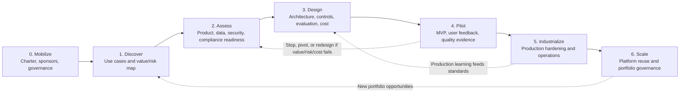

# AI Enablement Roadmap

The roadmap describes a path from initial exploration to repeatable, governed AI delivery. It's not meant to be followed rigidly — teams routinely adapt the sequence based on regulatory exposure, product maturity, data readiness, and deployment constraints. But the phases represent a logical order for a reason: work that's skipped early tends to come back as a production problem later.

## Roadmap Diagram

## Phase 0: Mobilize

Before your teams write a single line of code or evaluate a single model, you need the organizational scaffolding in place. Phase 0 is about creating the conditions for success — the sponsors, decisions, and guardrails that let teams move fast without creating risks that surface later as crises.

The temptation to skip this phase and "just start building" is strong. Resist it. Programs that skip mobilization typically end up rebuilding governance mid-delivery, which is far more disruptive than doing it upfront.

The work in this phase:

- Define what AI enablement actually means for your organization — not a vague aspiration, but specific products, users, and outcomes.
- Appoint sponsors with real authority: executive, product, technology, and risk. Names matter — these are the people who will break deadlocks and unblock funding.
- Establish governance forums and document who makes which decisions.
- Define initial AI policies: what's permitted, what's prohibited, what requires formal review.
- Select the first product areas or business domains to prioritize.
- Decide your deployment posture: public cloud, private cloud, on-premises, hybrid, or air-gapped.
- Create a lightweight process for teams to propose AI use cases.

By the end of Phase 0 you should have:

- An AI transformation charter capturing the vision, scope, and early governance decisions.
- A governance model with named participants and decision rights.
- An initial responsible AI policy.
- Approved pilot funding.
- High-level architecture principles.

You're ready to move to Phase 1 when sponsors are named and have accepted accountability in writing, funding and risk appetite are documented, and teams know how to propose and evaluate AI use cases.

## Phase 1: Discover and Prioritize

Phase 1 is about finding opportunities worth investing in. The most common mistake at this stage is letting technical enthusiasm drive prioritization — picking the use case that sounds most impressive rather than the one with the clearest path to business value.

The work:

- Run workshops with product, business, operations, support, security, compliance, and actual users. Each group sees a different set of pain points.
- Identify where users are doing manual work, where knowledge is bottlenecked, and where decisions are slow or inconsistent.
- Categorize opportunities by AI pattern — not every problem needs generative AI.
- Estimate business value, feasibility, data readiness, risk, and cost for the top candidates.
- Separate quick wins (which build confidence and generate early learning) from foundational investments (which enable scale later).

By the end of Phase 1 you should have:

- A use case backlog with rough prioritization.
- A value/risk matrix that makes the trade-offs visible.
- Prioritized pilot candidates with named owners.
- Initial success metrics for each candidate.

You're ready for Phase 2 when the top use cases have named owners and measurable outcomes, high-risk use cases have been flagged for deeper review, and you have a first-pass view of data sources and integration dependencies.

## Phase 2: Assess Readiness

A good use case idea can be blocked by poor data, a brittle architecture, high compliance exposure, or a team that doesn't have the skills to deliver it safely. Phase 2 surfaces those blockers early — before teams invest in building something that can't ship.

Assessment covers:

- Product architecture and integration capability.
- Data access, data quality, and data rights.
- Security and identity model.
- Compliance obligations and constraints.
- Integration complexity with existing systems.
- Operational maturity to monitor and support AI.
- Team skills across product, engineering, data, and security.
- User workflow impact and adoption path.
- Cost viability.

By the end of Phase 2 you should have:

- A product readiness assessment.
- A data readiness assessment.
- A security and privacy assessment.
- Architecture options with a recommended direction.
- A pilot delivery plan.

You're ready for Phase 3 when major blockers are visible and have owners, the selected use case has a feasible delivery path, and required controls are defined before build begins.

## Phase 3: Design Target Solution

This is where you make the important technical and governance decisions — before implementation, when changes are cheap. Teams that jump straight to building without a design phase almost always rebuild significant portions of what they ship.

The work:

- Select the AI pattern that fits the problem: RAG, classification, forecasting, recommendation, document intelligence, agentic workflow, embedded copilot, or automation.
- Define human-in-the-loop controls: where does a human need to approve, correct, or override?
- Create a threat model and privacy impact assessment.
- Define the evaluation strategy: what does "good" look like, and how will you measure it?
- Establish model selection criteria and document the choice.
- Design integration, fallback, and recovery behaviors.
- Define monitoring, audit logging, and support approach.
- Estimate cost per user, task, transaction, and environment at realistic volume.

By the end of Phase 3 you should have:

- A solution architecture.
- A data flow diagram.
- A control design document.
- An evaluation plan with acceptance thresholds.
- A production readiness checklist (pre-populated for this use case).
- A cost model.

You're ready to build when architecture, security, privacy, and product owners have approved the design, risks are accepted or mitigated with explicit ownership, and success metrics and quality gates are defined.

## Phase 4: Pilot

The pilot proves — or disproves — that the use case creates real value safely and economically. The key word is "prove." A demo that shows the model can answer questions is not evidence. A pilot with real users, real data, and real evaluation results is.

The work:

- Build a thin but realistic AI-enabled workflow — not a demo, but something close enough to production to generate meaningful signal.
- Integrate with real or production-like data using approved access paths.
- Run offline and human evaluation against the criteria defined in Phase 3.
- Test adversarial, privacy, and security scenarios.
- Measure latency and cost at realistic usage patterns.
- Collect structured user feedback.
- Validate that fallback and escalation paths work.

By the end of Phase 4 you should have:

- A working pilot or MVP.
- An evaluation report with results against the defined thresholds.
- A user feedback summary.
- Documented risk and control validation.
- A cost baseline at tested usage levels.
- A go/no-go recommendation with clear rationale.

You're ready for Phase 5 when the pilot meets minimum value, quality, risk, and cost thresholds, production gaps are documented with owners, and a sponsor has explicitly approved industrialization — or termination.

## Phase 5: Industrialize

Moving from pilot to production is a bigger step than most teams expect. A pilot can get away with manual monitoring, approximate access controls, and informal runbooks. Production cannot.

The work:

- Implement production-grade identity, access control, logging, and monitoring.
- Add automated evaluation pipelines that run on CI/CD and on a schedule.
- Implement model and prompt versioning with rollback capability.
- Design and test deployment, rollback, and fallback mechanisms.
- Write support runbooks — the people who answer user issues at 11pm need clear escalation paths.
- Complete compliance evidence collection.
- Conduct an operational readiness review.
- Train support, operations, and user-facing teams before launch day.

By the end of Phase 5 you should have:

- A production release candidate that has passed the production readiness checklist.
- An operational runbook.
- Monitoring dashboards with alert thresholds set.
- Audit and compliance evidence.
- User communications and training materials.

You're ready to launch when production readiness gates have been passed, support and incident processes are tested and ready, and model, data, and system ownership is unambiguous.

## Phase 6: Scale

Once you have one or two use cases working well in production, the question becomes how to replicate that success across more products and teams without losing the controls that made it safe. Platform investment pays off here.

The work:

- Build reusable AI platform capabilities: model gateway, prompt management, evaluation service, policy enforcement.
- Standardize what teams should share versus what they should own.
- Create communities of practice so teams learn from each other's production experience.
- Automate governance evidence collection — manual compliance evidence doesn't scale.
- Track benefits realization at the portfolio level.
- Optimize cost and vendor usage across all use cases.

By the end of Phase 6 you should have:

- An enterprise AI platform roadmap.
- Reusable reference architectures and delivery templates.
- A metrics dashboard covering value, quality, risk, cost, and adoption.
- A portfolio-level scaling plan.

You're operating at scale when multiple teams can deliver AI features safely using shared standards, governance is measurable and repeatable, and AI investment decisions are connected to realized outcomes.

## Roadmap by Organization Maturity

| Maturity | Characteristics | Recommended Focus |
| --- | --- | --- |
| Initial | Experiments scattered, tools ungoverned, governance unclear | Charter, policy, intake process, first pilots |
| Emerging | Several pilots delivered, limited reuse, inconsistent controls | Architecture standards, evaluation rigor, security gates |
| Scaling | AI in production across multiple products | Platform capabilities, FinOps, monitoring, responsible AI review |
| Optimized | AI is part of the normal product operating model | Continuous improvement, automated governance, portfolio optimization |

## Timeline Guidance

These ranges are realistic for organizations that resource the work seriously. They'll stretch if key decisions are deferred or if foundational work (data quality, security architecture) turns out to need more remediation than expected.

| Time Horizon | Typical Focus |
| --- | --- |
| Days 1–30 | Mobilize leadership, educate key stakeholders, define governance, collect use cases |
| Days 31–60 | Prioritize pilots, assess products and data, define policies and architecture direction |
| Days 61–90 | Build pilots, run evaluations, validate controls and cost |
| Months 3–6 | Industrialize the winners, create platform foundations, train teams |
| Months 6–12 | Scale across products, optimize cost, mature governance and operations |
