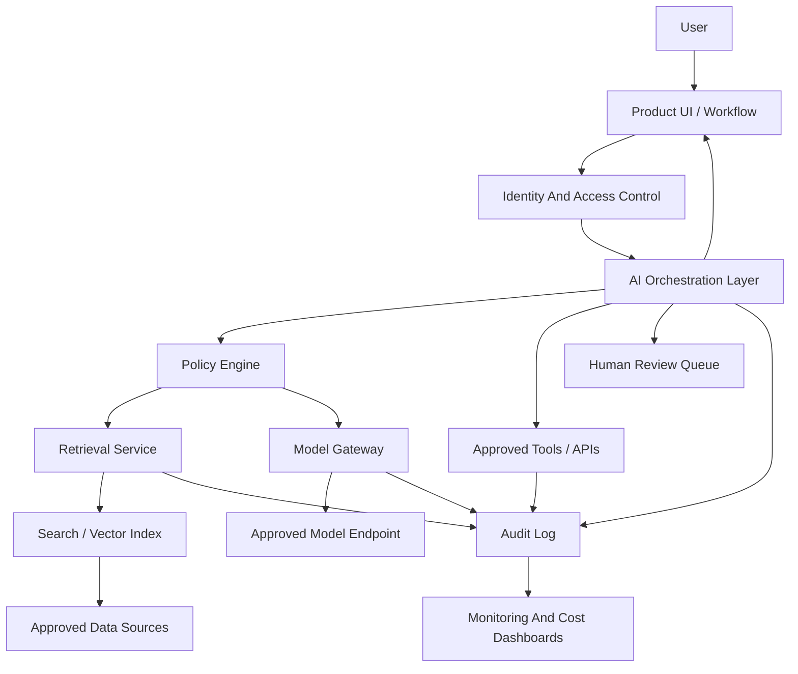
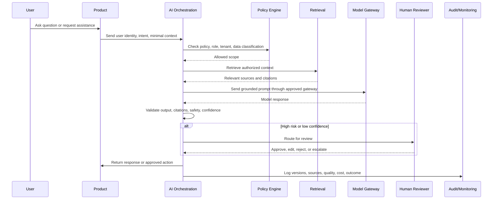
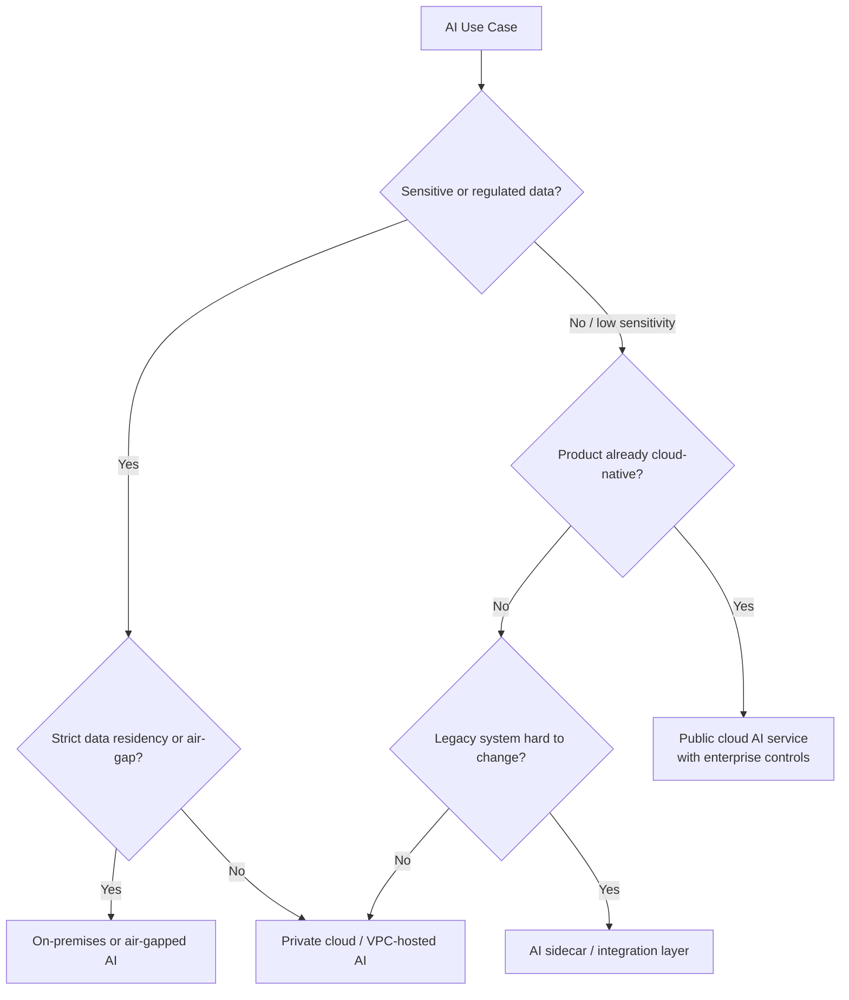

# Architecture Reference Guide

Good AI architecture is disciplined engineering, not creative improvisation. The decisions you make about how to structure model access, data flow, observability, and controls shape whether your system is trustworthy and operable in production — or a source of recurring incidents.

The right architecture depends on your deployment environment, risk tier, data sensitivity, and integration constraints. This guide covers the principles, building blocks, and patterns that work across most enterprise contexts.

## Core Architecture Principles

These hold regardless of which specific technologies you choose:

- Keep sensitive data under explicit control. Know where it goes, who can see it, and how long it lives.
- Use identity-aware and policy-aware access to data and tools throughout the stack — not just at the UI layer.
- Separate orchestration, model access, retrieval, and product UI concerns. When these are tangled together, changes are expensive and incidents are hard to trace.
- Centralize common controls: logging, evaluation, model routing, and policy enforcement. Teams that solve these independently produce inconsistent results and create audit nightmares.
- Design for fallback when models, data sources, or integrations fail. AI dependencies are new failure modes your product didn't have before.
- Version prompts, models, retrieval indexes, evaluation sets, and policies — all of them. A behavioral change in production should always be traceable to a specific version change.
- Make AI behavior observable and auditable. You cannot monitor what you haven't instrumented.

## Common Building Blocks

| Component | Purpose |
| --- | --- |
| Product UI | The user experience layer where AI capability appears |
| AI orchestration layer | Coordinates prompts, tools, retrieval, models, validation, and workflow state |
| Model gateway | Controls access to approved models and providers, enforces rate limits and logging |
| Retrieval service | Searches approved enterprise knowledge or product data |
| Vector database or search index | Stores embeddings, metadata, and searchable chunks |
| Policy engine | Enforces access, data handling, and action permissions |
| Evaluation service | Runs offline and online tests for quality and safety |
| Audit log | Records inputs, outputs, model versions, user actions, and decisions |
| Monitoring | Tracks latency, errors, quality signals, cost, drift, and incidents |
| Human review queue | Routes uncertain or high-risk outputs to authorized reviewers |

## Reference Architecture Diagram

## RAG Data Flow Diagram

## Deployment Pattern Decision Tree

## Deployment Patterns

### Public Cloud AI Service

Best for rapid pilots, low-to-medium sensitivity use cases, and products already running in public cloud.

Controls:
- Enterprise contract with clear data retention and training-use terms.
- Private networking where the provider supports it.
- Regional deployment to meet data residency requirements.
- Model gateway with logging, rate limits, and quota enforcement.

### Private Cloud or VPC-Hosted AI

Best for sensitive enterprise data, regulated workloads that can accept cloud deployment, and use cases requiring custom model hosting.

Controls:
- Private endpoints — traffic stays within your network perimeter.
- Customer-managed encryption keys.
- Network segmentation between AI services and other systems.
- Workload identity for service-to-service authentication.
- Centralized observability.

### On-Premises AI

Best for strict data residency, air-gapped environments, and customer-controlled infrastructure.

Controls:
- Local model hosting with validated artifacts.
- Offline supply chain validation — you need to know what you're running.
- Hardware capacity planning before deployment, not after.
- Local monitoring with export capability for aggregated metrics.
- Secure patch and model update process that works without cloud connectivity.

### Hybrid AI

Best for enterprises with both cloud and on-premises systems, legacy products that can't move data freely, and gradual modernization programs.

Controls:
- Data minimization at integration boundaries — only send what the cloud service needs.
- Tokenization or redaction before data crosses into cloud environments.
- Private connectivity between environments.
- Explicit data flow approval for each integration.
- Consistent identity and audit correlation across environment boundaries.

## AI Patterns

### Retrieval-Augmented Generation

Use when the model needs to answer from your organization's knowledge rather than from model training data.

Key design choices that significantly affect quality:
- Chunking strategy — how you split documents affects what gets retrieved.
- Metadata and access control tags on each chunk.
- Embedding model choice and consistency with retrieval model.
- Search strategy: vector, keyword, hybrid, or with reranking.
- Citation and source grounding requirements.
- Content refresh frequency aligned with how quickly the source material changes.

Risks to manage: retrieving content the user isn't authorized to see, stale sources, and confident answers drawn from weak or incomplete context.

### Fine-Tuning

Use when the behavior, style, or output format you need can't be achieved reliably with prompting or retrieval. Good candidates are classification tasks, structured extraction, domain-specific language patterns, and high-volume repeated tasks where prompt length is a meaningful cost factor.

Avoid fine-tuning when the underlying knowledge changes frequently (retrieval is better), source attribution is required, or data rights are unclear.

### Agentic Workflow

Use when AI needs to plan, call tools, and coordinate multi-step workflows that can't be captured in a single prompt-response exchange.

Controls: tool allowlist with scoped permissions, step and budget limits, human approval for irreversible actions, sandboxed execution, full trace logging. See the Implementation Patterns document for detailed guidance on agentic design.

### Predictive ML

Use for forecasting, ranking, anomaly detection, scoring, recommendations, and optimization where you have historical labeled data.

Controls: feature lineage tracking, training-serving skew checks, bias and performance monitoring by segment, model drift detection, and explainability where decisions affect individuals.

### Embedded Copilot

Use when AI augments a user's existing workflow inside a product — helping them work faster and better while keeping them in control.

Controls: clear visual indicators for generated content, edit and undo paths, human approval before AI output is sent externally or committed, feedback capture.

## Reference Data Flow

The typical AI-assisted interaction moves through these steps:

1. User requests assistance in the product UI.
2. Product sends user identity, task intent, and minimal context to the AI orchestration layer.
3. Policy engine checks whether the user, use case, and data classification are permitted.
4. Retrieval service fetches only the context the user is authorized to see.
5. Orchestration layer builds the prompt with instructions, retrieved context, and safety constraints.
6. Model gateway routes the request to the approved model endpoint.
7. Output is validated, filtered, and cited where applicable.
8. High-risk or low-confidence outputs route to human review.
9. Response is returned to the user.
10. Audit, quality, and cost metrics are logged.

## Architecture Decisions to Document

Document these decisions as Architecture Decision Records (ADRs) — your future self and your auditors will thank you:

- Model provider and deployment location, including alternatives considered.
- Data residency and cross-border transfer approach.
- Network path and encryption strategy.
- Identity propagation and authorization model.
- Prompt and context construction approach.
- Retrieval source systems and access control implementation.
- Embedding storage, access control, and retention.
- Human review requirements and routing logic.
- Output validation and filtering approach.
- Logging scope and redaction strategy.
- Monitoring signals and alerting thresholds.
- Fallback and rollback strategy.
- Cost controls and quota configuration.

## Minimum Production Architecture Controls

A system isn't ready for production without all of these:

- Approved model access path.
- Authentication and authorization at every layer.
- Data classification enforcement at the retrieval layer.
- Secure secrets management.
- Prompt and model versioning.
- Evaluation pipeline.
- Audit logging.
- Monitoring dashboard with alerts configured.
- Rate limits and cost budgets.
- Tested fallback behavior.
- Incident runbook.
