# Training Curriculum and Reference Links

AI enablement fails when only a few people understand it. The whole team — executives, product managers, engineers, data professionals, security leads, legal and compliance staff, and end users — needs enough context to do their job well in an AI-enabled environment. This curriculum gives each audience the right depth for their role.

Review access, pricing, and regional availability before assigning training at scale. Free tiers and availability change over time.

## Training Paths by Audience

| Audience | Goal | Recommended Topics |
| --- | --- | --- |
| Executive leaders | Make informed investment, governance, and risk decisions | AI strategy, value cases, risk appetite, responsible AI, cost governance |
| Product leaders | Shape AI-enabled product roadmaps | Use case discovery, UX patterns, metrics, human oversight, adoption |
| Engineering teams | Build secure, reliable AI capabilities | Architecture, RAG, model integration, evaluation, DevSecOps, LLMOps |
| Data teams | Prepare and govern AI-ready data | Data quality, lineage, classification, embeddings, privacy, retention |
| Security teams | Protect AI systems from misuse and attack | Prompt injection, model threats, tool safety, logging, red teaming |
| Risk, legal, privacy, compliance | Govern AI responsibly | AI RMF, ISO 42001, privacy impact, automated decision-making, audit evidence |
| Operations and support | Run AI safely in production | Monitoring, incident response, fallback, model/prompt lifecycle, FinOps |
| General workforce | Use AI appropriately | AI literacy, approved tools, data handling, verification, escalation |

## Leadership Learning Path

Recommended sequence:

1. AI fundamentals and business value — what AI can and can't do.
2. Responsible AI and enterprise risk — where things go wrong and why governance matters.
3. Governance and operating model — decision rights, forums, and accountability.
4. Cost, funding, and vendor strategy.
5. Product portfolio prioritization — choosing where to invest.

Suggested resources:

| Resource | Provider | Best For |
| --- | --- | --- |
| [OpenAI Academy](https://openai.com/academy/) | OpenAI | General AI literacy and practical AI usage in business |
| [Microsoft AI Learning Hub](https://learn.microsoft.com/en-us/ai/) | Microsoft Learn | Role-based learning across business and technical paths |
| [Google Cloud Generative AI Leader](https://cloud.google.com/certification/generative-ai-leader) | Google Cloud | Leaders who want structured generative AI strategy and governance knowledge |
| [Google Cloud Skills Boost](https://www.cloudskillsboost.google/paths/) | Google Cloud | Learning paths across cloud, AI, data, and security |
| [AWS Skill Builder: AI/ML](https://explore.skillbuilder.aws/learn/catalog?ctldoc-catalog-0=se-%22Artificial%20Intelligence%22) | AWS | Cloud AI and generative AI for leaders and builders |
| [NIST AI Risk Management Framework](https://www.nist.gov/itl/ai-risk-management-framework) | NIST | Executive and risk leadership alignment on trustworthy AI |
| [ISO/IEC 42001:2023](https://www.iso.org/standard/42001) | ISO | AI management system structure and governance expectations |

## Product and Business Team Learning Path

Recommended sequence:

1. AI use case discovery — how to identify opportunities worth pursuing.
2. Human-centered AI product design — designing AI into workflows, not on top of them.
3. Responsible AI controls — what your team is accountable for.
4. Measurement and benefits realization — proving the value delivered.
5. Adoption and change management — making sure people actually use what you build.

Suggested resources:

| Resource | Provider | Best For |
| --- | --- | --- |
| [OpenAI Academy](https://openai.com/academy/) | OpenAI | Practical AI use and AI literacy |
| [Microsoft Learn: Introduction to generative AI and agents](https://learn.microsoft.com/en-us/training/modules/fundamentals-generative-ai/) | Microsoft Learn | Non-specialist understanding of generative AI, LLMs, prompts, and agents |
| [IBM: What is AI Ethics?](https://www.ibm.com/think/topics/ai-ethics) | IBM | Accessible overview of AI ethics and governance |
| [NIST AI RMF Playbook](https://airc.nist.gov/AI_RMF_Knowledge_Base/Playbook) | NIST | Practical risk management actions mapped to the AI RMF |

## Engineering and Architecture Learning Path

Recommended sequence:

1. Generative AI fundamentals — how models work, what influences their behavior.
2. Prompting and model behavior — system prompts, context construction, structured outputs.
3. RAG and enterprise integration patterns.
4. AI security and threat modeling — prompt injection, tool abuse, and the OWASP LLM Top 10.
5. Evaluation, observability, and LLMOps — operating AI in production.

Suggested resources:

| Resource | Provider | Best For |
| --- | --- | --- |
| [OpenAI Prompting Guide](https://platform.openai.com/docs/guides/prompting) | OpenAI | Prompting techniques for application builders |
| [Anthropic Prompt Engineering Overview](https://docs.anthropic.com/en/docs/prompt-engineering) | Anthropic | Prompt design practices and examples |
| [Microsoft Generative AI for Beginners](https://github.com/microsoft/generative-ai-for-beginners) | Microsoft | Developer-friendly generative AI curriculum |
| [Google Cloud: Advanced Generative AI for Developers](https://www.skills.google/paths/183) | Google Cloud | App developers, ML engineers, and data scientists |
| [AWS Skill Builder](https://skillbuilder.aws/) | AWS | AWS AI, ML, and cloud architecture training |
| [OWASP Top 10 for LLM Applications](https://owasp.org/www-project-top-10-for-large-language-model-applications/) | OWASP | Security risks and mitigations for LLM applications |

## Data, ML, and MLOps Learning Path

Recommended sequence:

1. Data governance and quality for AI.
2. ML fundamentals — how models learn, what they need.
3. Model evaluation — metrics, datasets, and what "good" means.
4. Feature, embedding, and retrieval pipelines.
5. MLOps and LLMOps — operating AI systems in production at scale.

Suggested resources:

| Resource | Provider | Best For |
| --- | --- | --- |
| [Google Cloud Skills Boost: ML Engineer Learning Path](https://www.cloudskillsboost.google/paths/) | Google Cloud | Structured ML and cloud data learning |
| [Microsoft Learn AI Training](https://learn.microsoft.com/en-us/training/browse/?terms=AI) | Microsoft Learn | AI, data, and Azure role-based modules |
| [AWS Machine Learning Learning Plan](https://skillbuilder.aws/learn/public/learning_plan/view/28/machine-learning-learning-plan) | AWS | ML foundations and AWS ML services |
| [NIST AI RMF](https://www.nist.gov/itl/ai-risk-management-framework) | NIST | Risk-aware AI lifecycle management |

## Security, Privacy, Risk, and Compliance Learning Path

Recommended sequence:

1. AI threat landscape — what's different about securing AI systems.
2. Prompt injection and LLM application security.
3. Privacy and data protection for AI — GDPR, automated decision-making, data subject rights.
4. Responsible AI governance — principles, policies, and approval frameworks.
5. Evidence, audit, and incident response for AI systems.

Suggested resources:

| Resource | Provider | Best For |
| --- | --- | --- |
| [OWASP Top 10 for LLM Applications](https://owasp.org/www-project-top-10-for-large-language-model-applications/) | OWASP | LLM-specific security risks and mitigations |
| [NIST AI Risk Management Framework](https://www.nist.gov/itl/ai-risk-management-framework) | NIST | Trustworthy AI governance and risk management |
| [NIST AI RMF Playbook](https://airc.nist.gov/AI_RMF_Knowledge_Base/Playbook) | NIST | Operationalizing AI risk management |
| [ISO/IEC 42001:2023](https://www.iso.org/standard/42001) | ISO | AI management system requirements |
| [Microsoft Responsible AI](https://www.microsoft.com/ai/responsible-ai) | Microsoft | Responsible AI principles and practices |

## Recommended Internal Training Modules

Build short internal modules that adapt this playbook to your specific policies, tools, and environment. Generic training doesn't produce the behavioral change you need.

| Module | Audience | Duration | Output |
| --- | --- | --- | --- |
| AI Enablement Overview | All stakeholders | 60 minutes | Shared vocabulary and operating model |
| Responsible AI and Acceptable Use | All users | 45 minutes | Signed policy acknowledgement |
| Use Case Discovery Workshop | Product and business teams | 2–4 hours | Prioritized use case candidates |
| Secure AI Architecture | Engineering and security | 2 hours | Architecture checklist and threat model starter |
| Data Readiness for AI | Data and product teams | 2 hours | Data source inventory and gap analysis |
| Evaluation and Quality Gates | Product, engineering, data, risk | 2 hours | Evaluation rubric and acceptance thresholds |
| AI Operations and Incident Response | Operations, support, security | 90 minutes | Runbook walkthrough and tabletop exercise |
| AI Cost and FinOps | Product, engineering, finance | 60 minutes | Cost model and budget controls |

## Training Rollout Plan

```mermaid
gantt
    title AI Enablement Training Rollout
    dateFormat  D
    axisFormat  Day %d
    section First 30 Days
    Leadership briefing                 :a1, 1, 7d
    Responsible AI baseline             :a2, after a1, 7d
    Use case discovery training         :a3, after a2, 10d
    section Days 31-60
    Engineering architecture training   :b1, after a3, 10d
    Security and compliance workshops   :b2, after a3, 10d
    Data readiness workshops            :b3, after a3, 10d
    section Days 61-90
    Evaluation and quality gates        :c1, after b1, 10d
    Operations and incident simulations :c2, after b2, 10d
    Cost and portfolio review           :c3, after c1, 7d
```

Adjust start timing to your program start date.

## Training Completion Evidence

In regulated or audited environments, keep training records that demonstrate compliance:

- Training module name and version.
- Audience and role.
- Completion date.
- Assessment score where applicable.
- Policy acknowledgement (for responsible AI and acceptable use modules).
- Exception or overdue completion tracking.
- Refresher due date.

## Recommended Training Cadence

| Activity | Cadence |
| --- | --- |
| Executive AI briefing | Quarterly |
| Responsible AI refresher | Every 6–12 months |
| Secure AI engineering training | Every 6 months |
| Incident simulation | Twice per year |
| Use case discovery workshops | Before planning cycles |
| New joiner AI literacy | During onboarding |
| Policy update briefing | Whenever AI policy materially changes |
